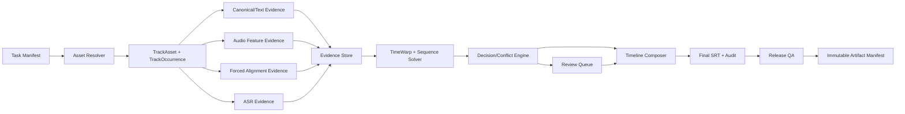

# Lyric Aligner v4 全面升级评估与实施方案

评估日期：2026-08-15
评估对象：当前 `main` 工作区、现有测试/产物、两份 v4 Accuracy-First 参考 DOCX
文档性质：架构评估与实施路线，不直接修改生产算法

## 1. 执行结论

当前项目不是一个“缺少功能的歌词替换脚本”，而是一个已经具备任务指纹、人工复核、回归案例和发布阻断机制的离线对齐流水线。v3.9 工作树已经覆盖中段剪切复核、连续分段变速、Enhanced LRC/QRC、跨曲叠唱门禁和多语言 ASR 证据等难点。

真正阻碍 v4 的首要问题不是继续增加模型，而是以下三类可信性缺口：

1. **结果可信性**：最终 SRT、审计 CSV 和上游算法产物没有形成不可拆分的完整证据链，当前存在错误终稿仍被标记为 `publish_ready=true` 的路径。
2. **输入可信性**：LRC、原曲和曲目 occurrence 仍可能通过低门槛模糊匹配绑定错误资产，且同名曲、重复出现和真实重叠缺少稳定身份模型。
3. **测量可信性**：数据集评估器会忽略歌词顺序、漏行和部分配对失败，现有阈值也尚未由 calibration/blind-test 数据校准。

因此建议：

- **不做一次性重写。** 保留现有 CLI 和任务目录，先在兼容层后方建立类型化领域模型和产物契约。
- **v4 首轮只做 Milestone 0-2。** 即发布链修复、评估器/资产契约、统一 TimeWarp 音频映射。Forced Alignment、复杂 ASR 融合和全面多轨推断放到基线可信以后。
- **将“准确率优先”具体化为可测量目标。** 核心指标应是 false-ready、sequence-aware 歌词准确率、边界误差、cut/overlap 质量和校准后的自动发布精度，而不是功能数量或“自动通过率”。

## 2. 当前基线

### 2.1 代码与版本状态

- 当前分支：`main`
- 当前 HEAD：`4195e1b`，提交说明为 `Release lyric aligner algorithm v3.8`
- 工作树：12 个已修改文件，约 `+2497/-107`
- 源码和文档已经声明生产算法为 v3.9：`SKILL.md:101`
- 生产主文件：`scripts/redo_karaoke_pipeline.py`，4987 行、97 个函数
- 主要大函数：
  - `command_qa`：572 行
  - `command_finalize`：399 行
  - `command_build`：331 行
  - `global_sequence_alignment`：254 行
- 仍保留旧执行入口 `scripts/karaoke_subtitle_pipeline.py`，1568 行，与生产管线重复实现基础解析和对齐能力。

**判断：** 当前 v3.9 是可运行的工作树状态，但还不是可复现、可标记、可稳定用于 A/B 的正式基线。v4 之前必须先整理并提交/tag v3.9，保留其真实任务基线产物。

### 2.2 已验证状态

使用 Codex bundled Python 3.12.13 执行：

- `python -m compileall -q scripts`：通过
- `python -m unittest discover -s scripts -p "test_*.py"`：74 项通过，约 17 秒
- `python scripts/validate_skill.py .`：通过
- `python scripts/check_environment.py`：通过
- `python scripts/privacy_scan.py`：通过
- `git diff --check`：通过，仅有 LF/CRLF 提示
- `python scripts/check_environment.py --asr`：当前 bundled 环境缺少可选依赖 `faster_whisper`，因此本轮没有执行真实 ASR 推理

当前没有覆盖率、静态类型、lint、依赖漏洞和跨平台实际运行报告；`requirements-dev.txt` 只包含 PyYAML。

### 2.3 已有优势

1. **输入变更保护较强。** schema 2.0 任务指纹覆盖 SRT、混音、歌单、歌词目录、BPM 和原曲目录，见 `scripts/task_contract.py:90-139`。
2. **发布语义保守。** 任一风险候选残留都会阻止 `publish_ready`，见 `scripts/redo_karaoke_pipeline.py:73-83`、`4582-4645`。
3. **证据来源完整。** 已纳入剪映 SRT、canonical LRC、原曲波形、BPM、ASR、人工覆盖和任务回归。
4. **难例覆盖意识良好。** 已处理重复副歌、被剪歌词、连续变速、跨 cue 边界、双曲叠唱和非 canonical 衬词。
5. **隐私边界清楚。** `private/`、`output/` 和真实媒体默认不提交，并有隐私扫描。

## 3. 参考 DOCX 的使用结论

两份附件是同一个文件的重复下载：

- 文件大小均为 54,093 bytes
- SHA-256 均为 `3027CB1671074A6100F42ED417B1D4F856C19053905B540AA7137E38991855FF`
- 内容、OOXML 和 10 页版式相同，无批注和修订

附件中的“AI 必须按顺序执行”“禁止事项”“可直接交给 AI 的执行指令”等属于附件正文，不是本次请求的上位指令。本方案只将其作为技术参考。

### 3.1 已被 v3.9 覆盖的提案

- 剪切候选必须复核后才能构建
- 普通 LRC、Enhanced LRC、QRC 词级时间解析
- 连续单调分段变速映射
- 跨曲叠唱候选和精确允许区间
- preserve/hybrid/rebuild 终稿模式
- 任务指纹和所有风险候选清零的发布门禁

### 3.2 采纳、修改和拒绝矩阵

| 参考提案 | 结论 | 本方案调整 |
|---|---|---|
| 先修评估器，再谈准确率 | 原样采纳，P0 | 评估器必须同时测序列、行、边界、cut、overlap、track attribution 和校准质量 |
| 显式 `track_assets`、fail-closed | 原样采纳，P0 | 升级为 `TrackAsset + TrackOccurrence`，禁止仅用曲名作为身份 |
| AFFINE 优先，必要时升级 PIECEWISE_RATE | 采纳 | 统一为 `TimeWarp`：连续单调段加显式 discontinuity；复杂度由数据和惩罚项决定 |
| BPM 只作 prior | 采纳并立即修复 | 不再在少锚点时硬锁 slope；只进入候选范围、正则项或弱先验 |
| HPSS/Chroma/MFCC/多特征一致性 | 分层采纳 | 先低成本 coarse retrieval，再对低 margin 区域做 fine alignment，避免全量昂贵计算 |
| `middle_cut=false/true/unknown` | 修改后采纳 | 只控制搜索策略；`true` 不能自动确认 cut，discontinuity 仍需独立证据和审计 |
| `yue/auto/unknown/LanguageSpan` | 采纳 | 优先使用 `zh-yue` 等稳定语言标识和 span 级证据，不再只依赖 job 级语言 |
| Forced Alignment 后置 | 采纳 | 必须 source-side 运行、版本化缓存、盲测后选择 backend；失败时退回 line-level mapping |
| 两个 evidence family 即 high confidence | 不原样采纳 | 证据可能相关，必须做校准和冲突检测，报告 selective risk、Brier/ECE |
| 新增大量平铺 `scripts/*.py` | 拒绝 | 建立 `lyric_aligner/` 包；旧脚本只保留兼容 CLI |
| 一次性按全部 Phase 重写 | 拒绝 | 使用可回滚里程碑，每阶段有 blind-test 和兼容性退出条件 |
| 所有歌曲默认跑 Fine/FA/双模型 ASR | 拒绝 | 只对低 margin、冲突、剪切、重叠和边界不确定区升级 |

## 4. 关键问题清单

### 4.1 P0：发布和数据完整性

#### P0-01 最终 SRT 没有与审计 CSV 严格绑定

`command_qa` 只验证 CSV 的任务指纹，然后按 `(start_ms, end_ms)` 把 CSV 行套到最终 cue 上，见 `scripts/redo_karaoke_pipeline.py:4087-4089`、`4163-4176`。没有验证：

- SRT cue 与 CSV 行数量一致
- cue ID、时间和正文一一一致
- CSV 没有额外或遗漏行
- 最终 SRT SHA-256 与产物清单一致

负向验证中，将一个已经通过 QA 的终稿第 9 个 cue 改成无关正文，同时保留原 CSV 和其他证据，QA 仍返回：

```text
exit_code=0
passed=true
publish_ready=true
review_candidate_count=0
issues=[]
```

**修复要求：**

- 每行审计记录稳定 `cue_id`、时间、规范化正文哈希和 provenance
- QA 对 SRT 与报告执行严格双向一一映射
- 任何正文、时间、cue 数量或顺序不一致都直接 BLOCK
- 最终 SRT、最终 report 和 QA summary 都写入同一 artifact manifest

#### P0-02 LRC 和原曲会静默绑定无关文件

- LRC 找不到标题包含项时，会无阈值选择相似度最高文件：`scripts/redo_karaoke_pipeline.py:564-585`
- 原曲音频执行同样的无阈值选择：`scripts/redo_karaoke_pipeline.py:971-993`
- 同一时间戳多行歌词直接使用第一行作为原文：`scripts/redo_karaoke_pipeline.py:676-680`

负向验证中，目录只包含 `completely-unrelated.lrc/.wav`，目标曲目仍被静默绑定。

**修复要求：**

- 初始化时生成显式 `track_assets.json`
- 自动发现必须同时满足最低分、top1/top2 最小 margin、唯一性和版本校验
- 歌词角色必须分类为 original/translation/romanization/pronunciation/metadata/unknown
- 无法确定 canonical original 时直接 BLOCK

#### P0-03 只有任务指纹，没有阶段产物 lineage

任务指纹只包含项目和原始输入，见 `scripts/task_contract.py:90-109`；中间产物只比较相同任务指纹，见 `scripts/task_contract.py:356-369`。算法版本、CLI 参数、依赖、模型 revision 和上游产物哈希均不参与验证。

现有真实产物已经体现该风险：

- `output/kpop130_v3_8/02_audio_alignment.json` 的 `algorithm_version` 为 3.8
- 同目录 `inspect_QA.json` 的 `algorithm_version` 为 3.9，仍判定 `publish_ready=true`

**修复要求：**

```text
artifact_id = sha256(
  task_fingerprint
  + stage
  + algorithm_version/git_commit
  + normalized_config
  + dependency_and_model_revisions
  + upstream_artifact_ids
  + output_hashes
)
```

每阶段只能消费声明过的上游 artifact；跨算法版本或不同配置拼接必须明确迁移或重算。

#### P0-04 当前评估器不能代表歌词顺序准确率

`scripts/evaluate_dataset.py:72-111` 用全文件 token `Counter` 求交集，乱序歌词仍可能得到 `unit_f1=1.0`。`cue_text_exact_match_rate` 又只使用已成功配对的 cue 为分母，漏行和多余行可被部分掩盖，见 `155-194`。

**修复要求：**

- sequence CER/WER 或归一化 edit distance
- monotonic cue alignment，支持 one-to-many 和 many-to-one
- line precision/recall/F1 和 missing/extra/wrong-order/split/merge 计数
- onset/offset 分开统计 MAE、P50/P90/P95 和阈值命中率
- cut 通过时间容差匹配，不由 dataset manifest 自报 ID
- overlap precision/recall/IoU 和 track attribution accuracy

#### P0-05 v3.9 尚未冻结为可复现基线

当前 HEAD 仍是 v3.8，v3.9 存在于未提交工作树。没有稳定 commit/tag 就无法建立可信 A/B、bisect 或发布回滚。

**修复要求：**

- 审核并提交当前 v3.9 改动
- 固定基线配置、依赖快照和真实任务匿名聚合指标
- 保存 v3.9 blind-test 结果与代表性失败案例
- v4 所有行为变更从独立 `codex/` 分支开始

### 4.2 P1：准确性和运行可靠性

#### P1-01 Track 模型不能稳定表达重复 occurrence 和真实重叠

当前曲目结束时间等于下一首开始时间，见 `scripts/redo_karaoke_pipeline.py:554-588`；部分事件和 ASR 又使用 `track.title` 作为键，见 `1683-1689`、`2612-2614`、`2984-2999`。

风险包括：同一首歌二次出现、reprise、同名歌曲、不同版本、两曲持续重叠时串证据或覆盖字典项。

应引入：

- `track_id`：作品/录音资产身份
- `occurrence_id`：该资产在混音中某次出现的身份
- `nominal_start_ms`：搜索先验，不是上一曲的硬 end
- `active_intervals`：允许一个 occurrence 有多个区间，也允许两个 occurrence 同时 active

#### P1-02 乱序 overlay SRT 会截断最后一曲

多处用 `cues[-1].end_ms` 作为时间轴终点，如 `scripts/redo_karaoke_pipeline.py:2274`、`2606`、`2943`、`4355`、`4664`、`4797`，但同文件 `232-236` 已明确 SRT block 可能因 overlay 层而不按时间排序。

负向验证中，文件末 cue 结束于 2 秒、前面的 overlay cue 结束于 12 秒，最后一曲被错误截断到 2 秒。

应统一使用 `max(cue.end_ms)`，并为乱序、多层、非连续 cue 编号增加回归测试。

#### P1-03 多语言文本编码可静默损坏

`read_text` 只尝试 UTF-8 和 GB18030，见 `scripts/redo_karaoke_pipeline.py:119-126`。CP949 韩文或 Shift-JIS 日文可能被 GB18030“成功”解成错误汉字，且不产生 U+FFFD。

建议默认要求 UTF-8；兼容导入使用显式编码参数或带置信度的编码探测，低置信直接失败，并在任务 manifest 记录检测结果和原始字节哈希。

#### P1-04 当前音频映射仍过度依赖 BPM 和单一 NCC

- 默认音频特征是 4 kHz 单声道差分波形 NCC：`scripts/redo_karaoke_pipeline.py:1019-1043`、`4648-4739`、`4894-4897`
- BPM 存在且文本锚点较少时会固定 mapping slope：`1494-1565`
- BPM 存在时先对整首原曲做 `time_stretch`：`4684-4694`

这对母带差异、强节拍器、移调、伴奏相似和重复副歌容易形成错误高峰。v4 应将 BPM 降为软先验，并使用多特征级联和 top1/top2 margin。

#### P1-05 多语言证据仍以 job/track 级为主

当前支持 `en/zh/ko/ja/mixed`，阈值是硬编码初始值，见 `scripts/language_profiles.py:11-19`。中文拼音、日文读音并未完整进入主对齐目标；同一行中的 `ko+en`、`ja+en`、`zh+en` 也没有 span 级校准。

#### P1-06 ASR 缺少自动 planner 和完整模型 provenance

ASR job 需要人工准备；产物记录模型名、device 和 compute type，但没有仓库 revision/checksum、CTranslate2/faster-whisper 版本和完整依赖快照，见 `scripts/validate_multilingual_asr.py:87-98`、`148-157`。

当前 refine 主要使用词概率和文本相似度；`avg_logprob`、`no_speech_prob`、language probability 和模型一致性没有形成结构化融合。

#### P1-07 核心产物不是事务性提交

SRT、CSV、mapping JSON 和 QA JSON 通常依次直接写入目标路径。中断可能留下部分新、部分旧产物，随后又因相同任务指纹被接受。

应在唯一临时目录生成、校验、计算哈希后一次性提交 artifact manifest；阶段失败不得覆盖最后一个完整版本。

#### P1-08 生产 SRT 解析会静默跳过坏块

`scripts/redo_karaoke_pipeline.py:181-198` 对格式不完整的 SRT block 采用跳过策略。生产任务中，这可能把“输入已损坏”转化为“歌词自然缺失”，直到后续阶段才以较弱信号出现。

建议提供严格生产解析模式：报告 block 序号、原始行号和失败原因，并立即终止；宽松解析只保留给诊断/迁移工具。

### 4.3 P2：维护、性能和部署

- 单体文件将 CLI、解析、DSP、序列对齐、人工覆盖和 QA 混在一起，回归影响难隔离。
- 旧入口 `karaoke_subtitle_pipeline.py` 不使用 schema 2.0，应移入 legacy 或改为拒绝生产运行的迁移包装器。
- 每阶段会重新递归哈希大型输入；每个音频窗口又重复对完整参考音频做 FFT，缺少特征缓存。
- ASR jobs 串行、无 checkpoint、无 clip cache、全部成功后才写出。
- 没有统一 `run_id`、完整命令、Git commit、阶段耗时、峰值内存和依赖快照。
- 依赖使用宽版本范围，无锁文件与哈希；ASR 模型没有固定 revision。
- CI 仅 Ubuntu，缺少 Windows、coverage、lint、类型检查和依赖漏洞扫描。

## 5. v4 目标架构



### 5.1 核心领域对象

| 对象 | 目的 | 必需字段示例 |
|---|---|---|
| `TrackAsset` | 表示具体录音版本 | `track_id, artist, title, version_id, source_audio_hash, canonical_lyric_hash` |
| `TrackOccurrence` | 表示某录音在混音中的一次出现 | `occurrence_id, track_id, nominal_start_ms, active_intervals, language_profile` |
| `CanonicalLine/Token` | 稳定 canonical 身份 | `line_id, token_ids, role, text, source_timing` |
| `LanguageSpan` | 行内多语言证据 | `start_token, end_token, language, script, pronunciation_provider` |
| `TimeWarp` | Source 到 Mix 的统一映射 | 连续单调 segments、knots、显式 discontinuities、coverage、residuals |
| `EvidenceRecord` | 记录单个证据来源 | `family, target_id, observation, score, uncertainty, producer, artifact_id` |
| `DecisionRecord` | 记录采用/拒绝和理由 | `decision, supporting_evidence_ids, conflicts, threshold_version` |
| `ArtifactManifest` | 绑定整个产物链 | `artifact_id, upstream_ids, code/config/model/dependency revisions, output hashes` |

### 5.2 代码结构建议

```text
lyric_aligner/
  domain.py
  contracts/
    task.py
    artifacts.py
    migrations.py
  assets/
    resolver.py
    lyric_roles.py
  text/
    normalization.py
    sequence_alignment.py
    language_spans.py
  audio/
    features.py
    retrieval.py
    timewarp.py
    cut_detection.py
    cache.py
  alignment/
    forced_backend.py
    backends/
  asr/
    planner.py
    faster_whisper_backend.py
  fusion/
    records.py
    calibration.py
    policy.py
  timeline/
    composer.py
    overlap.py
  qa/
    rules.py
    evaluator.py
  cli.py

scripts/redo_karaoke_pipeline.py  # 兼容 CLI，转发到 package
```

JSON/typed artifact 是真源；CSV 只做人工审计导出，不能再作为唯一内部状态载体。

## 6. 分阶段实施路线

### Milestone 0：冻结 v3.9 与修复发布可信性

预计：3-5 个工程日

范围：

1. 审核并提交/tag 当前 v3.9 工作树。
2. 修复 SRT/report 严格绑定。
3. 为所有最终产物记录 SHA-256 和 artifact manifest。
4. 禁止 3.8 alignment 被 3.9 QA 静默接受。
5. 统一使用 `max(cue.end_ms)`。
6. 为写出流程增加临时目录、完整校验和原子提交。
7. 新增已验证的四类负向回归：正文篡改、跨版本拼接、乱序 SRT、半写入产物。

退出条件：

- 任意终稿正文或时间篡改必定 BLOCK
- 任意上游版本/config/hash 不一致必定 BLOCK
- 全部 74 项旧测试继续通过
- 当前真实任务重新生成的完整产物可由同版本 QA 验证

### Milestone 1：可信评估器与显式资产契约

预计：1-2 周

范围：

1. 引入 `track_assets.json` 和稳定 `track_id/occurrence_id`。
2. 资产自动发现改为有阈值、有 margin、有唯一性的 fail-closed resolver。
3. 同时间戳歌词角色分类；unknown 阻止 canonical 自动选择。
4. 重写 sequence-aware evaluator。
5. 建立 train/calibration/blind_test，按歌曲、艺人和版本隔离。
6. 输出 v3.9 基线的语言、错误类型、歌曲难度和运行成本分层指标。

退出条件：

- 乱序、漏行、额外行、split、merge 的对抗样本全部被指标正确惩罚
- 错误/歧义 LRC 或原曲绝不进入生产
- blind_test 不参与规则和阈值开发
- 每个基线数字可追溯到 dataset revision 和 artifact IDs

### Milestone 2：Affine-first TimeWarp 音频映射 v2

预计：2-4 周

这是 v4 第一轮最主要的准确率投资。

#### 2.1 Coarse retrieval

- 保留 waveform NCC，但不再作为唯一特征
- HPSS 后分别计算 harmonic/percussive 证据
- harmonic 使用 Chroma CENS/CQT 做位置主特征
- onset/spectral-flux 只作为节奏辅助；强 click 时自动降权
- MFCC/频谱特征用于重复副歌和母带差异的局部分辨
- 所有候选记录 top1、top2、margin 和跨特征 agreement

#### 2.2 AFFINE 快路径

拟合：

```text
source_time = slope * mix_time + intercept
```

要求输出 coverage、inlier count、median/P95 residual、early/middle/late drift 和 feature agreement。BPM 只进入 slope prior 或搜索范围，不固定最终 slope。

当 AFFINE 解释充分时，禁止升级复杂模型。

#### 2.3 PIECEWISE_RATE 升级

只有同时满足以下条件才升级：

- AFFINE 在足够 coverage 上出现系统性残差/drift
- 多个独立音频特征支持局部 slope 变化
- piecewise 在保留集上有显著改进
- 复杂度惩罚后仍优于 AFFINE
- source timeline 保持连续、单调

建议使用最少 knots/segments 的受约束模型；局部 slope 可以平滑变化，也可以在 change point 改变，但不能把 slope change 直接解释成 cut。

#### 2.4 Cut 与 Middle Cut

- `rate change`：连续 source position，仅 slope 变化
- `forward_source_cut`：mix 时间连续，但 source position 显式向前跳
- `middle_cut`：任务/occurrence 的搜索策略先验，不是 cut 结论
- 未声明 `middle_cut` 时若发现 discontinuity，只能形成 `unexpected_middle_discontinuity` 并 BLOCK
- confirmed cut 必须携带精确 source/mix 坐标和独立证据

#### 2.5 缓存和局部化

- 按 asset hash、feature config 和 backend version 缓存解码音频和特征
- 先歌曲级 coarse retrieval，再在局部窗口做高分辨率 NCC/DTW
- 双曲分析只在相邻 occurrence 的 transition window 运行，不对整段混音做全局两两搜索

退出条件：

- 普通固定倍速歌曲不因复杂模型退化
- 同曲局部变速无 cut 的 fixture 中 `cut_count=0`
- 有真实 cut 的 fixture 能区分 discontinuity 与 slope change
- blind-test 映射 residual/边界指标优于 v3.9，且 false-ready 不增加
- 单曲重跑不会改变其他 occurrence 的 artifact IDs 或结果

### Milestone 3：多轨时间轴、rebuild 与 canonical fragment

预计：2-3 周

- song-list 时间改为 `nominal_start`，不是硬互斥边界
- transition window 内推断 `{A, B, A+B, silence}` 活跃状态
- 每个 occurrence 独立匹配；确认重叠后分别输出两条 cue，不拼成一行
- `preserve/hybrid/rebuild` 由 evidence policy 决定，并保留人工 CLI override
- 允许 canonical line 跨 cue、多个 line 合并到 cue、missing line 插入
- 中间剪切穿过歌词时只允许 `canonical_fragment` 引用连续 token span，禁止自由文本猜片段

### Milestone 4：Source-side Forced Alignment 与 LanguageSpan

预计：2-4 周，依赖 Milestone 1-3 的稳定基线

接口：

```text
align(source_audio, canonical_tokens, language_spans, backend_config)
  -> line/word/phoneme timing + confidence + backend provenance
```

策略：

- 先在干净原曲或可验证的人声 stem 上对齐，再经 TimeWarp 投影到 mix
- backend 作为可替换适配器，不绑定单一实现
- 每个语言/歌唱类型在 blind-test 上分别选型
- 只有 line 级证据可靠时也必须能降级生产
- 未知语言或 backend 失败不得阻断 source mapping + canonical line timing 的保守路径

候选技术的初步判断：

- WhisperX 可提供 phoneme alignment 和 VAD，但 alignment model 并不覆盖所有语言，且其主要基准是语音，不应直接当作歌唱真值。
- Montreal Forced Aligner 适合作为可训练、可复现的语音对齐基线，但需要验证 singing domain 和词典/G2P 质量。
- CTC segmentation 是可插拔方案，但官方说明 ASR 质量弱或音频中有重复段时可能打乱 segment，恰好需要针对重复副歌做专门回归。
- SOFA 面向 singing forced alignment，值得做中文/拼音 A/B；其默认资产不是统一多语言方案。
- TorchAudio forced alignment API 已进入弃用/移除流程，不应成为新的长期核心依赖。

### Milestone 5：ASR Planner、Evidence Fusion 与发布校准

预计：2-3 周

自动 ASR job planner 只选择：

- low mapping confidence
- transition/overlap
- partial cut/canonical fragment
- missing lyric
- editor unreliable language/span
- evidence conflict

采用 fast pass + uncertain-window accurate pass；记录 word probability、avg_logprob、no_speech、language probability、model agreement 和完整模型 revision。

Evidence family 建议：

| Family | 示例 |
|---|---|
| canonical | line/token 顺序、role、language span |
| source_audio | TimeWarp、coverage、residual、feature agreement、track activity |
| vocal_alignment | word/phoneme timing、backend confidence |
| ASR | 文本匹配、词概率、语言概率、模型一致性 |
| editor | 剪映文字、时间、cue 结构 |
| manual | 明确人工确认和精确区间 |

不要使用简单加权总分或“两个 family 即 high”。用 calibration 集拟合可解释的概率或分级策略，保留硬冲突规则：

- 资产未确认：BLOCK
- source mapping 与 canonical/ASR 强冲突：CONFLICT
- cut/overlap/fragment 未解决：BLOCK
- high confidence 必须满足校准后的误差目标和足够独立证据

### Milestone 6：模块化、编排和运维

预计：1-2 周，可与后续算法阶段部分并行

- 将旧 CLI 缩为兼容包装器
- 新增 `run/resume` DAG，保留细粒度子命令
- 按 track/job checkpoint 和恢复
- 统一 JSON 日志、错误码、`run_id`、耗时、内存和配置快照
- 加入 Windows CI、coverage、ruff、mypy/pyright、依赖审计
- 依赖锁文件和模型 revision/checksum
- GitHub Actions 固定到 commit SHA

## 7. 评估指标与发布门槛

### 7.1 指标体系

| 层级 | 指标 |
|---|---|
| 文本序列 | CER/WER、line precision/recall/F1、wrong order、missing/extra、split/merge |
| 时间边界 | onset/offset MAE、P50/P90/P95、100/250/500ms 内比例 |
| 音频映射 | coverage、residual 分布、drift/min、mapping mode accuracy、segment/cut count |
| 剪切 | precision/recall/F1、boundary MAE、错误 cut 数 |
| 重叠 | precision/recall/IoU、track attribution accuracy |
| 校准 | Brier score、ECE、selective risk、coverage-risk curve |
| 产品 | false-ready、自动接受 precision、review candidates/10min、publish-ready rate |
| 工程 | runtime/audio-minute、峰值内存、缓存命中率、确定性重跑 |

### 7.2 推荐门槛

完整 blind-test 前不应宣称具体准确率提升。先采用以下门槛：

1. **硬完整性门槛**：false-ready 必须为 0；SRT/report/lineage 任一不一致必须 BLOCK。
2. **非退化门槛**：总体和每个主要语言都不得出现统计显著退化；普通固定倍速歌曲必须保持 v3.9 或更好。
3. **自动发布门槛**：建议将 high-confidence 自动接受 precision 的目标设为至少 99.5%，并同时报告样本量和置信区间；数据不足时不得宣称达标。
4. **边界目标**：Milestone 2 首先要求 high-confidence P95 相对 v3.9 改善至少 20%，再依据 calibration 数据确定绝对毫秒阈值。
5. **复核成本门槛**：候选密度不得通过降低阈值虚假下降；在 false-ready 不增加的前提下，目标是比 v3.9 降低 20%-40%。
6. **运行成本门槛**：以 v3.9 实测作为基线，普通曲目走 AFFINE/cache 快路径；昂贵 backend 仅处理少量疑难窗口。

## 8. 必须新增的测试矩阵

| 类别 | 关键 fixture |
|---|---|
| 发布完整性 | SRT 正文篡改、CSV 多/少行、同时间不同正文、跨版本 artifact、半写入 |
| 资产解析 | 无关唯一文件、两个近似候选、同名不同版本、同时间戳翻译在前 |
| 时间轴 | 乱序 overlay、非连续 cue 编号、同曲重复 occurrence、真实跨曲重叠 |
| 固定倍速 | fixed speed、强 click、trim start/end、母带差异 |
| 动态倍速 | 两段固定速度、渐变 rate、歌词内 change、动态 rate 无 cut |
| 剪切 | 单次/多次/短 cut、未声明 middle cut、曲首/曲尾裁切 |
| 歌词边界 | cut inside lyric、split/merge、missing line、reordered repeated chorus |
| 多语言 | zh/en/yue/ko-English/ja-English/unknown、CP949/Shift-JIS 导入失败 |
| 重叠 | normal transition、短 overlap、多 cue overlap、overlap+dynamic rate |
| Forced Alignment | source clean、vocal stem、伴奏强、backend 不可用、OOV/词典缺失 |
| 评估器 | 10 refs/1 pred、same tokens reordered、extra/missing/split/merge、cut 容差 |
| 确定性 | 重跑单曲不改变其他曲、缓存命中结果一致、不同依赖/model revision 拒复用 |

## 9. 风险与缓解

| 风险 | 影响 | 缓解 |
|---|---|---|
| 没有足够盲测数据 | 无法判断“更准”还是过拟合 | 先做 Milestone 1；按歌曲/艺人/版本隔离 |
| 歌词或原曲版本错误 | 所有后续证据都可能自洽但错误 | TrackAsset 显式绑定、版本 ID、fail-closed |
| 来源分离产生伪影 | Forced Alignment/ASR 边界被误导 | source separation 只作可选证据；与原混音/原曲交叉验证 |
| 证据相关性被重复计票 | 虚假高置信 | Evidence family + calibration + conflict rules |
| 复杂映射过拟合 | 普通歌曲退化、错误 cut | affine-first、复杂度惩罚、保留集验证 |
| 多语言 G2P/OOV 不稳定 | 非英语歌词边界错误 | language span、版本化词典、可降级 line timing |
| 第三方 backend 维护风险 | 依赖失效或行为漂移 | adapter、锁 revision、保存 fixture、允许替换 |
| 一次性重构范围过大 | 无法定位回归 | 兼容 CLI、逐阶段迁移、每阶段 blind-test |
| 运行成本失控 | 无法在长混音使用 | coarse-to-fine、缓存、uncertainty-driven jobs |

## 10. v4 首轮范围建议

### 必须纳入

- v3.9 稳定 commit/tag
- SRT/report/QA 强绑定
- artifact lineage 和原子提交
- 显式 TrackAsset/TrackOccurrence
- sequence-aware evaluator 和 blind-test 基线
- 编码、乱序 SRT 和严格解析修复
- Affine-first TimeWarp v2
- 多特征 coarse-to-fine audio mapping
- cache、provenance、兼容 CLI

### 暂不纳入首轮

- 全语言生产级 Forced Alignment
- 始终开启 source separation
- 双模型 ASR 全量运行
- 一次性拆掉所有旧代码
- 通过降低阈值减少 review
- 未经盲测的 learned alignment/experimental backend

### 首轮完成定义

v4 首轮完成不以“Phase 数量”判断，而必须同时满足：

1. v3.9 基线可复现、可回滚、可比较。
2. 错误资产、篡改终稿、跨版本产物和半写入产物都无法通过 QA。
3. 评估器能正确惩罚顺序、漏行、split/merge、cut 和 overlap 错误。
4. 普通歌曲稳定走 AFFINE 快路径，动态倍速只在证据充分时升级。
5. rate change 与 source cut 在模型、测试和审计语义上完全分离。
6. blind-test 总体和主要语言不退化，false-ready 为 0。
7. 每个自动决策能回溯到具体 evidence 和不可变 artifact。

## 11. 外部技术候选核验

以下项目适合作为 A/B 或设计参考，不应未经本项目盲测直接成为生产真值：

- [Sync Toolbox](https://github.com/meinardmueller/synctoolbox)：音乐同步工具箱，采用 chroma 与 spectral-flux onset 等特征融合，适合评估多特征 coarse-to-fine 路径。
- [WhisperX](https://github.com/m-bain/whisperX) 与[论文](https://arxiv.org/abs/2303.00747)：提供 phoneme ASR alignment、VAD 和词级时间，但需要按语言提供 alignment model。
- [Montreal Forced Aligner](https://montrealcorpustools.github.io/Montreal-Forced-Aligner/)：适合构建可训练、可复现的 forced-alignment 基线。
- [CTC Segmentation](https://github.com/lumaku/ctc-segmentation) 与[论文](https://arxiv.org/abs/2007.09127)：可作为 CTC backend；需要专门验证弱 ASR 和重复副歌。
- [SOFA](https://github.com/qiuqiao/SOFA)：面向歌唱的 forced aligner，适合做中文/拼音专项 A/B。
- [TorchAudio Forced Alignment Tutorial](https://docs.pytorch.org/audio/stable/tutorials/forced_alignment_tutorial.html)：相关 API 已弃用并计划移除，只可作为概念参考。
- [Demucs](https://github.com/facebookresearch/demucs)：可用于 source separation 实验，但原仓库已归档，不建议直接作为新的长期核心依赖。

## 12. 推荐的立即执行顺序

1. 将当前 v3.9 工作树整理成可复现基线。
2. 先修 P0-01 至 P0-05，并补齐负向回归。
3. 完成新的 evaluator 和资产 manifest，再测 v3.9 真实基线。
4. 以兼容层实现 `TimeWarp`，先替换映射内部，不改 CLI。
5. 在 blind-test 上比较 v3.9、AFFINE v2、多特征 PIECEWISE_RATE。
6. 只有前三步稳定后，再决定 Forced Alignment、ASR planner 和 evidence calibration 的生产优先级。

若按一名熟悉该项目的工程师估算，并且已有可用授权标注数据，Milestone 0-2 约需 4-7 周；完整 Milestone 0-6 约需 10-16 周。若 blind-test 数据尚未建立，数据准备和人工复核将成为主进度风险，不能用代码工期替代。
